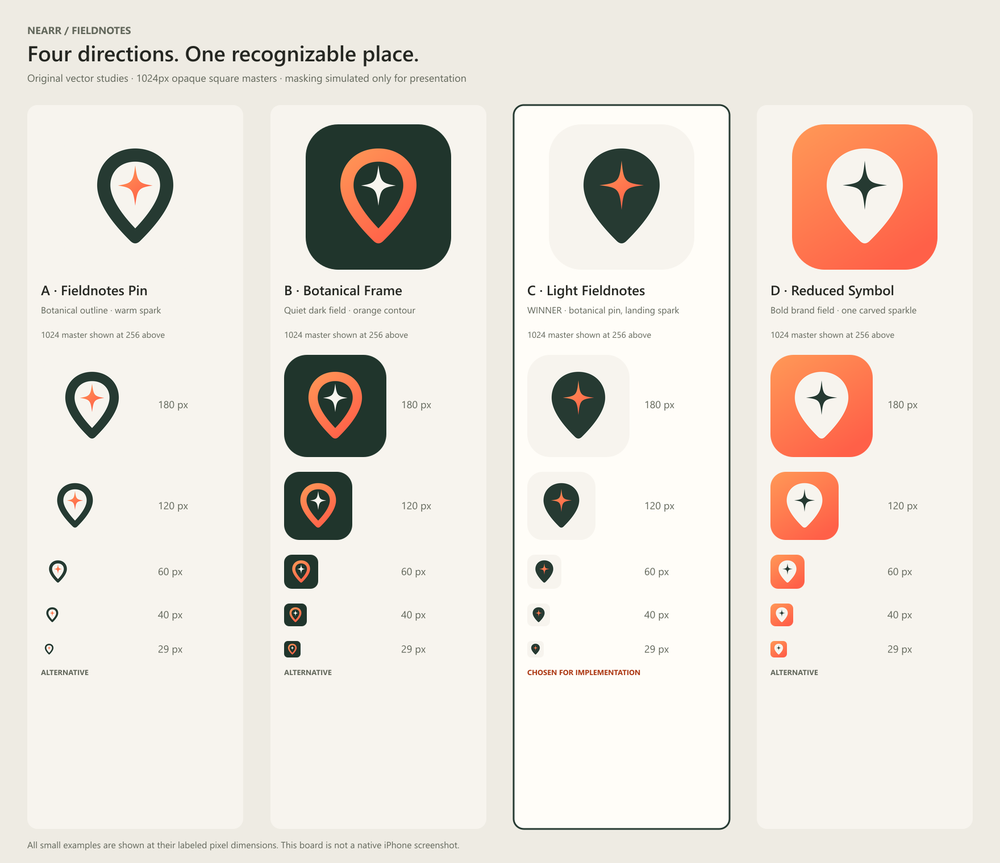
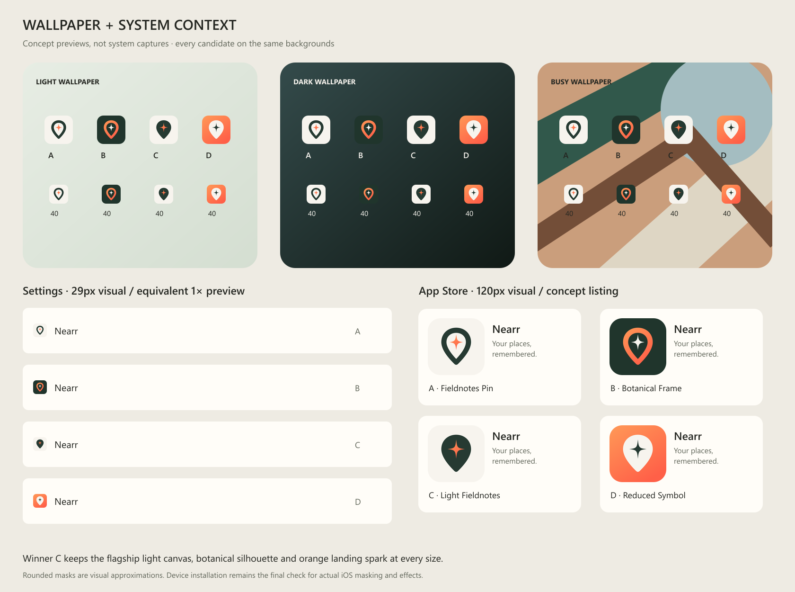

# Nearr Fieldnotes app icon study

October 9, 2026. **Winner: C — Light Fieldnotes.** This study replaces the prior design study's instruction to retain the existing app icon because the implementation brief explicitly requests a new icon. The old artwork remains evidence, not a proposed production source.

## Decision

C gives the flagship light experience a recognizable icon: warm ivory, a solid botanical place silhouette and one orange landing spark. It carries forward location, sparkle and orange/red brand equity while removing the old black tile, light bloom, floating halo and tiny satellite stars. The large central spark remains legible at Settings size. The solid pin makes a stronger small silhouette than an outline whose ring and spark compete.

These are original vector constructions, not generated bitmap variants or copied stock map symbols. They intentionally share a custom softened pin silhouette so the study compares real brand relationships rather than unrelated logos. The pin is recognizable as a location, while the central four-point landing spark is the Nearr identifier. No name or letters appear inside any icon.

| Candidate | Construction | Strength | Limitation | Decision |
|---|---|---|---|---|
| A — Fieldnotes Pin | Botanical outline on warm ivory; orange spark | Clear connection to the old outlined pin; light and restrained | Orange against ivory has less contrast, especially at 29px; reads more like a conventional map outline | Keep as a study only |
| B — Botanical Frame | Orange contour and ivory spark on botanical field | Closest continuity to current icon; strong contrast; clean at small size | Dark tile overstates the secondary dark appearance; a ring and separate spark use more visual detail | Strong runner-up; not registered as an alternate icon |
| **C — Light Fieldnotes** | Solid botanical pin and orange spark on warm ivory | Best small silhouette, strong internal contrast, flagship palette, controlled orange | Pin remains a familiar category symbol; distinctiveness depends on consistent sparkle usage | **Selected** |
| D — Reduced Symbol | Ivory filled pin, botanical spark, full orange/red field | High visibility and very simple geometry | Orange dominates rather than marking the saved-place moment; weaker tie to the calm editorial app | Study only |

### Comparative judgment

Scores are designer judgment on a 1–5 scale, not user research or trademark clearance. “Category distinction” means avoiding the usual blue/red standalone map pin; it is not a guarantee of legal uniqueness.

| Criterion | A | B | C | D |
|---|---:|---:|---:|---:|
| Recognizable Nearr pin/spark relationship | 4 | 5 | 5 | 4 |
| Contrast | 3 | 5 | 5 | 4 |
| 29–60px legibility | 3 | 4 | 5 | 5 |
| Brand distinctiveness | 4 | 4 | 4 | 3 |
| Fieldnotes light consistency | 5 | 3 | 5 | 3 |
| Category distinction | 3 | 4 | 4 | 3 |
| Total /30 | 22 | 25 | **28** | 22 |

## What was inspected before drawing

Client reference: `ca08c154347096fe5da0bf2739cf0b25c0b706b0`, the 1.5.58 RC. Sources read only: `assets/icon.png`, `app.json`, `app.config.js`, `components/onboarding/demo/NearrAppIcon.tsx`, installed Expo icon generation code, generated iOS directory, Git icon history, `NEARR_VISUAL_SYSTEM_V2.md` and `NEARR_BRAND_EXTENSION.md`.

- The current icon is 1254×1254 with a pre-rendered black rounded tile, outlined orange/red pin, three white sparkles and a glowing landing halo. SHA-256 `6dc46f0aef13561cafe6447dd47847e8505a609ff6afc9fab66ed5a104e23d11`.
- `3468488` used a fork inside the pin with a white outer margin. `c648369` enlarged the dark tile and fork mark. `18f237e` replaced the fork with sparkles. Their original PNGs are retained under `evidence/`.
- `expo.icon` and `expo.ios.icon` both use `./assets/icon.png`; the dynamic config spreads these values rather than replacing them. Onboarding's `NearrAppIcon` also loads the canonical source, so updating it keeps the demonstration consistent.
- The checked local `ios/` directory contains Share Extension entitlements and plist, but **no generated host AppIcon asset catalog**. It cannot prove the installed icon. A separately generated icon catalog was created under this study's `evidence/generated-sdk51/` using the project's installed Expo icon generator.
- Installed toolchain inspected: Expo **51.0.39**, `@expo/prebuild-config` **7.0.9**, `@expo/config-types` **51.0.3**.

## Size and context review

All four full 1024 masters were opened individually. The contact sheet was inspected with actual-size 180, 120, 60, 40 and 29px examples. All four candidates were placed on the same light, dark and busy wallpaper simulations and in Settings- and App Store-style presentations. The previews use an approximate rounded mask; they are **not native iOS screenshots**.

| Size | Finding for winner C |
|---|---|
| 1024px | Clean Bézier curves, smooth gradient, balanced margins, no texture or accidental edge pixels. Full square background reaches every corner. |
| 180px | Large spark and pin remain distinct; neutral canvas feels like the light product rather than a generic glowing badge. |
| 120px | App Store card reads clearly; no need for a wordmark or tiny peripheral stars. |
| 60px | Home-screen-size preview maintains the pin silhouette and orange center against all three backgrounds. |
| 40px | Both semantic shapes remain separate; the filled silhouette is more stable than candidate A's contour. |
| 29px | The four-point form becomes optically softer but still reads as a warm spark within the dark place. No fine rings or satellite elements disappear. |

The ivory field separates the mark from dark and busy wallpaper. On light wallpaper the tile boundary is quiet, while the botanical mark still has a strong contour. C is intentionally not given a keyline around the tile: iOS owns the outer mask and effects. Settings and store examples use the same source, not optically different artworks that could weaken recognition.

## Master specification

- Canonical handoff: `winner-icon-1024.png`.
- Editable artwork: `winner-icon.svg` and `sources/c-light-fieldnotes.svg`.
- Dimensions: **1024×1024**.
- PNG: **RGB, sRGB, 3 channels, no alpha channel, opaque**.
- SHA-256: **`ac3ed31cf494843c72c5049e480e77f2af2fc74dcc8b9a85ce636aba0cc2db2a`**.
- Canvas: `#F7F4EE`; pin: `#263A32`; spark: `#FF9957 → #FF6048`.
- Artwork bounds: x244–780, y170–839. Minimum distance from artwork to canvas edge: 170px. The important mark is well inside the icon mask; the background is full bleed. These are design margins, not an Apple-mandated numeric safe zone.
- No baked round corners, outer shadow, gloss, translucent background, text or unbounded glow.

`evidence/validation.json` records metadata and hashes for all four masters. `sizes/` contains all six requested sizes for every candidate. These resized files are review assets; Expo/Xcode should generate the actual native icon variations from the master.

## Apple requirements and SDK compatibility

Apple specifies a square 1024×1024 layout for iOS app icons and applies the final rounded mask. Its current design guidance also discusses layered Icon Composer artwork and multiple appearances. The ordinary asset-catalog path can generate icon variations from one 1024 image. This project retains that compatible standard path. [Apple app icon guidance](https://developer.apple.com/design/human-interface-guidelines/app-icons), [Apple asset-catalog configuration](https://developer.apple.com/documentation/xcode/configuring-your-app-icon).

The opaque, unmasked RGB PNG also avoids the legacy asset-catalog issues Apple documents for transparent icons or baked rounded borders. It does not claim to be layered Icon Composer output. [Apple QA1686](https://developer.apple.com/library/archive/qa/qa1686/).

**Do not copy modern `ios.icon.light/dark/tinted` or `.icon` configuration into this SDK51 app.** The current Expo docs expose those options, but the SDK51 documentation URL now redirects to latest. Local installed `ExpoConfig.d.ts` defines `ios.icon?: string`; its `getIcons()` returns `config.ios?.icon || config.icon`, and `generateUniversalIconAsync()` passes that path to image generation. Thus SDK51's installed stock path does not support the modern object form. No upgrade or custom native icon plugin is warranted for this change. [Current Expo icon configuration](https://docs.expo.dev/versions/latest/config/app/#icon), [Expo icon setup](https://docs.expo.dev/develop/user-interface/splash-screen-and-app-icon/).

The mandatory standard icon is prepared and works in both app appearances. Alternative candidates are **not alternate app resources**. Dark, tinted and layered versions are deferred until a separately validated toolchain upgrade supports them. The operating system may apply its own effects; physical-device review remains necessary.

## Native generation evidence and remaining build proof

`verify-sdk51.cjs` called the installed `generateUniversalIconAsync` with this isolated study directory as its project root. It generated:

`evidence/generated-sdk51/ios/Nearr/Images.xcassets/AppIcon.appiconset/App-Icon-1024x1024@1x.png`

The result is 1024×1024, opaque and has **identical decoded RGB pixels** to the winner. Generated PNG bytes differ because Expo re-encodes it: SHA-256 `88f9be93097adc681d146e34812662ea5a25af65a17d5931834ea48f95ac25a0`. `evidence/sdk51-generation.json` records this result. This checks the actual installed generator without touching any release source.

This is **not proof of the final Development binary**. Integration must copy the winner to the isolated implementation's `assets/icon.png`, preserve both Expo icon paths, generate the native app, and verify the resulting archive/IPA icon. Use decoded pixels or expected resized pixels when comparing generated assets because native compilation can change PNG encoding. The final build report must record its Git SHA and the icon source hash, inspect the archive's icon resources where available, and capture the installed home screen. An OTA does not replace the launcher icon.

## Reproduction, authorship and safety

`generate.cjs` authors the SVG paths and renders the files through Sharp; `verify-sdk51.cjs` performs the isolated native-generation check. The scripts currently reference the inspection machine's installed dependencies and RC path explicitly. They write only under this study directory. No release branch, source icon, Production asset, service, deployment or Git commit was changed by the study.

All candidate marks and wallpaper geometry are original code-authored artwork for Nearr. Existing icon images are user-project reference evidence. No stock artwork, third-party brand mark, photograph or external font is embedded. The board uses a system font available on the inspection machine. There are no third-party image credits to carry into the app icon.
