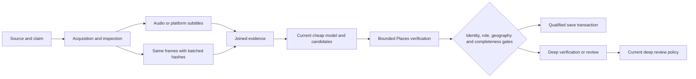

# Selected recognition implementation

Winner means **the best locally validated branch**, not deployment approval or proof of improved all-user autonomous accuracy.

1. Keep Development's exact-identity, source/candidate geography, entity-role and review safeguards. Block automatic named-lead recovery from failed parents; server evidence remains authoritative. Ordinary automatic deep results retain the existing review policy.
2. Acquire and inspect media using current providers. Prefer actual platform subtitles. Keep current configured ASR and ordinary 24-frame maximum; do not mistake a caption description for timestamped speech.
3. Extract the same timestamped JPEG evidence as the repaired baseline. Batch perceptual hashing to reduce FFmpeg startup overhead. Invalid hashes retain their frame. Preserve the existing temporal/diverse selection and deep 6-to-15-frame escalation.
4. Join audio/transcript and frames before analysis. Concurrent preparation is implemented and tested, but `MEDIA_PARALLEL_PREPARATION_ENABLED` defaults false until shared-worker resource testing. `MEDIA_FRAME_EXTRACTION_STRATEGY=legacy` provides the frame rollback.
5. Preserve the configured cheap visual model and source-grounded candidate generation. Canonicalize premium candidates with exact query semantics, geographic qualifiers, an explicit field mask, per-execution success memoization/coalescing, a maximum of three simultaneous requests, and stable output order. Count actual requests, including failed attempts; do not cache failures.
6. Keep Sol available under the existing escalation policy. An explicitly multi-place result with partial/broad identities cannot bypass deeper handling merely because one exact place is present. Each place still needs identity and geography support; aliases must not inflate the set.
7. Recheck task attempt and lock identity before stages and poll during work. Abort obsolete work cooperatively. Fence worker writes by claim and ordinary Edge save/result/terminal mutations in database transactions. Canonical place, saved-place, category, source and ledger writes commit together per saved candidate. This is not a new whole-multi-set transaction.
8. Preserve manual review, Wrong Place correction, source groups, notifications and existing client result schemas. Jev, the new deterministic evidence router, OCR, retrieval and geometry have no new automatic-save authority. Unsafe answer-cache reads remain suspended.

The database claim fence is the authority when cancellation arrives too late to stop a provider. Queued Places calls are suppressed; an already active external request can remain billed and cancellation completion depends on provider transport behavior. No live avoided-call percentage is established.

No new Python, OCR, retrieval or GPU package enters the worker dependency graph. Their scripts and weights remain evaluation-only. There is no new production imagery index. The reports distinguish conditional retained-output policy replay from media parity, synthetic scheduling and descriptor experiments. Raw captions, source-geography extraction and some complete provider response sets are unavailable in the replay.

Integration requires the forward migrations, Edge callback code and worker claim payload together. Drain old workers before the callback contract changes: callbacks without a claim are rejected. Preserve the currently advanced Development lane; this branch has not been deployed. See `FOUNDER_QA_PLAN.md` for qualification and rollback boundaries.
