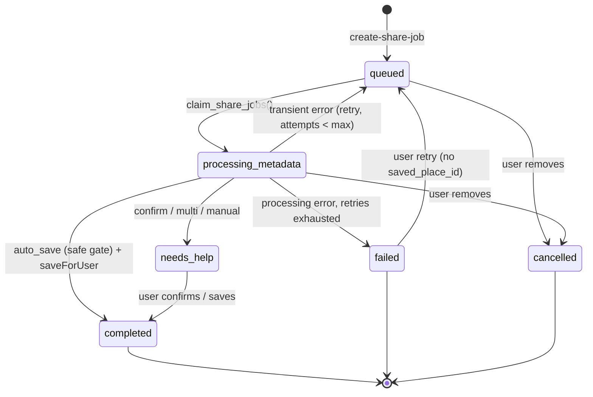

# Nearr — Async Share Jobs (Phase 1)

> Last updated: 2026-07-31
> Status: implemented behind `EXPO_PUBLIC_ASYNC_SHARE_JOBS_ENABLED` (default **OFF**)
> Scope: metadata/caption/address resolver only. **No video download in Phase 1.**

Replaces the synchronous "share → open app → wait" flow with an asynchronous
share-job flow: the share extension validates the URL, creates a durable job,
and dismisses immediately. A durable worker processes the job out of band using
the **existing** `process-share-link` resolver, then sends a push notification.
An in-app queue is the source of truth.

The old synchronous flow is fully preserved and used whenever the flag is off.

---

## Job state machine



Push delivery for terminal jobs (`completed`, `needs_help`) now uses a durable
notification state machine stored on `share_jobs` and processed independently
from job completion. Hard `failed` sends **no** push (nothing actionable).

Guarantee: **at-least-once submission with duplicate suppression and bounded retry**.
Exactly-once delivery is not achievable with Expo push semantics.

### Decision mapping (resolver → job)

| resolver decision | job outcome | notification |
| --- | --- | --- |
| `auto_save` **and** `safeToAutoSave` **and** primary candidate | `completed`, `saved_place_id` set (via `saveForUser`) | "Found `<place>`" |
| `auto_save` without the safety gate | `needs_help` (single) | "Is this `<name>`?" |
| `candidate_confirmation` / `candidate_picker` | `needs_help` (single) | "Is this `<name>`?" |
| `multi_candidate_confirmation` | `needs_help` (multi) | "We found N possible locations" |
| `manual_fallback` | `needs_help` (manual, `suggested_query`) | "We need help finding this place" |
| `failed` (resolver) | `needs_help` (manual — a user can still search) | manual copy |
| metadata fetch failed | `needs_help` (manual) | manual copy |
| processing error, retries exhausted | `failed` status | none |

The deterministic **`safeToAutoSave` gate is unchanged** — auto-save is never
loosened. Wrong silent saves remain worse than asking.

---

## Schema

Four additive, reversible migrations (each has a commented DOWN section):

- `20260731000001_share_jobs.sql` — the queue (source of truth) + `claim_share_jobs()` + realtime.
- `20260731000002_user_push_tokens.sql` — Expo push tokens + `register_push_token()` RPC.
- `20260731000003_share_jobs_worker.sql` — pg_cron + pg_net worker wiring (defensive).
- `20260731000004_share_jobs_notifications.sql` — durable notification state + retry/receipt claims + short-window URL dedupe create RPC.

### `share_jobs`

Owner-only RLS. Key columns: `status` (`queued|processing_metadata|completed|
needs_help|failed|cancelled`), `decision`, `saved_place_id` (FK → `saved_places`
**ON DELETE SET NULL** so removing a place never orphans and deleting a job never
deletes a place), `candidate_payload` / `extraction_payload` (JSONB),
`suggested_query`, `needs_help_reason`, `failure_reason`, `idempotency_key`,
worker fields (`attempts`, `max_attempts`, `locked_until`, `last_error`), plus
notification fields:
- `notification_status` (`pending|sending|submitted|retryable_failed|permanently_failed`)
- `notification_attempts`, `notification_last_attempt_at`, `notification_next_attempt_at`
- `notification_ticket_ids` (Expo ticket id + token row id pairs)
- `notification_error_code`, `notification_submitted_at`, `notification_payload`, `notification_receipts_checked_at`

**Idempotency / duplicate behavior:**
- unique `(user_id, idempotency_key)` — client `clientRequestId` retries return the same job.
- short-window same-URL dedupe is enforced atomically by `create_share_job_for_user(..., p_dedupe_window_seconds)` (default 90s).
- intentional re-share after the dedupe window is allowed, even if an older job is still in-flight.

**Claiming (`claim_share_jobs`):** `FOR UPDATE SKIP LOCKED` so concurrent worker
invocations never grab the same row; reclaims rows whose `locked_until` lease
expired (crashed worker) while `attempts < max_attempts`. `SECURITY DEFINER`,
executable by `service_role` only.

### `user_push_tokens`

Owner-only RLS. `unique(token)`. `register_push_token(token, platform, device_id)`
is a `SECURITY DEFINER` RPC that reassigns a device token to the current user
(last-writer-wins) so an account switch on one device only ever delivers to the
signed-in user. Invalid tokens (`DeviceNotRegistered`) are set `enabled = false`.

---

## Component flows

### Share extension (iOS)  — `ShareExtension.tsx`

Flag on → `AsyncShareExtension`:
1. Extract first URL from the share payload.
2. Read the App Group access token (`sharedAuth.getToken()`). **No token → "Open Nearr to sign in"** (host handoff, no job created).
3. `POST create-share-job` with a stable `clientRequestId`.
4. States: **Submitting** (spinner + "Finding the place…" + Close), **Accepted** ("Added to your queue", auto-dismiss ~1.4s + immediate Done), **Signed out**, **Network failure** (Retry + "Open Nearr instead"). Never claims queued unless the server accepted.
5. Dismiss. It never waits for extraction, never downloads media, never opens the host app after a successful submit.

Flag off → `LegacyShareExtension` (unchanged synchronous handoff).

### Android — `plugins/withAndroidShareIntent.js` + `app/share.tsx`

Android has no separate extension process; the share intent rewrites to
`nearr://share?url=…` and opens the host `/share`. With the flag on, `/share`
renders `ShareJobHandoff` (create job + confirm + dismiss). This is the Android
"submit then close" parity. Flag off → the legacy synchronous `/share` screen.

### Worker — `supabase/functions/process-share-jobs`

Invoked by the pg_cron sweep (durability) and the AFTER-INSERT pg_net trigger
(low latency). Auth = a dedicated high-entropy scheduler secret sent in the
`x-nearr-worker-secret` header and compared in constant time against the
`SHARE_JOBS_WORKER_SECRET` function env. This is independent of the Supabase
service-role key, so a service-role key rotation can never silently break the
scheduler (the exact failure this replaced — see migration
`20260731000006_share_jobs_worker_secret.sql`). The service-role key as an
`Authorization` bearer is still accepted as a manual/admin fallback. The
endpoint is deployed with `--no-verify-jwt` (a private scheduler URL) so the
dedicated secret is the sole gate and is validated before any work. Steps:
`claim_share_jobs()` → for each job: `normalizeShareUrl` → `fetchPostMetadata` →
`extractHandles/extractEvidence/extractTaggedLocation` → `resolveSharedPlace` →
map decision → (`saveForUser` for auto_save) → terminal transition. In the same
invocation, the worker also:
- claims pending/retryable/stale-sending notifications
- submits pushes to Expo with bounded backoff retries
- stores Expo ticket ids
- claims and checks receipts
- disables `DeviceNotRegistered` tokens

No extraction logic is duplicated — it reuses `process-share-link` modules.

### Push tokens — `lib/pushTokens.ts`

Registered after login and on app foreground **only** when the flag is on and
notification permission is already granted (never prompts here). Uses
`getExpoPushTokenAsync({ projectId })` + `register_push_token` RPC. Never logs the
token. This is distinct from the local place-reminder notifications.

### In-app queue — `app/share-jobs/`

`useShareJobs` reads Supabase directly (works with notifications denied),
subscribes to realtime, and polls while jobs are active. Sections: **Needs your
help** (badged), **Processing**, **Recently found**, **Failed**. The map shows a
`ShareQueueButton` with a `needs_help` badge (only ordinary processing jobs are
never badged). The `[jobId]` detail screen reuses `usePlacesSearch` +
`saveSavedPlace` + the shared saved-places cache for candidate-confirm,
multi-select, and manual search — resolving a job updates it transactionally and
never deletes a saved place.

### Notification tap routing

`lib/notificationTapRouting.ts` resolves structured `data` only;
`components/NotificationTapController.tsx` applies the route after the existing
auth shell is ready. Cold retrieval and the warm response listener share the
same exactly-once ledger. Title/body copy is never parsed:
- `share_job_completed` → `/(tabs)/map?savedPlaceId=<id>`
- `share_job_needs_help` → `/share-jobs/<jobId>`
- completed multi-place results → grouped map focus
- mixed/partial multi-place results → `/share-jobs/<jobId>`

---

## Feature flag

`EXPO_PUBLIC_ASYNC_SHARE_JOBS_ENABLED` (default **off**), resolved by
`lib/featureFlags.ts` (`process.env` first, then `expoConfig.extra`). Because
`EXPO_PUBLIC_*` is inlined at build time, flipping the flag requires a new build
(or OTA JS update). When off, every surface keeps the existing synchronous
behavior.

Also needed at runtime:
- `EXPO_PUBLIC_CREATE_SHARE_JOB_URL` — the `create-share-job` function URL.

---

## Worker setup (operator, once)

```sql
-- 1. Extensions (Dashboard → Database → Extensions, or SQL):
create extension if not exists pg_net;
create extension if not exists pg_cron;

-- 2. Worker endpoint (Vault preferred):
select vault.create_secret('https://<REF>.supabase.co/functions/v1', 'share_jobs_worker_edge_base_url');

-- 3. Dedicated scheduler secret (PRIMARY auth). Set the SAME value in BOTH the
--    Vault secret and the function env. Never commit it; never EXPO_PUBLIC it.
--    a) generate: openssl rand -hex 48   (or in SQL: encode(gen_random_bytes(48),'hex'))
--    b) Vault:
select vault.create_secret('<WORKER_SECRET>', 'share_jobs_worker_secret');
--    c) function env:
--       supabase secrets set SHARE_JOBS_WORKER_SECRET='<WORKER_SECRET>' --project-ref <REF>

-- 4. (Optional, back-compat) legacy service-role bearer:
select vault.create_secret('<SERVICE_ROLE_KEY>', 'share_jobs_worker_service_key');
```

### Worker secret rotation

The scheduler secret is independent of the service-role key and rotates on its
own schedule. To rotate (a brief mismatch only causes retried 401s — the durable
queue + cron sweep recover with no data loss once both sides match again):

```sql
-- 1. New value:  openssl rand -hex 48
-- 2. Vault:
select vault.update_secret(
  (select id from vault.secrets where name = 'share_jobs_worker_secret'),
  '<NEW_SECRET>');
-- 3. Function env (same value):
--    supabase secrets set SHARE_JOBS_WORKER_SECRET='<NEW_SECRET>' --project-ref <REF>
-- 4. Verify a 2xx:
select public.invoke_process_share_jobs();
select status_code, timed_out from net._http_response order by created desc limit 1;
```

Keep the service-role key (`SUPABASE_SERVICE_ROLE_KEY`) for database
administration only — it is no longer required for the scheduler to authenticate.

If pg_cron was enabled *after* the migration ran, (re-)schedule the sweep:

```sql
select cron.schedule('process-share-jobs-sweep', '* * * * *',
  $$ select public.invoke_process_share_jobs(); $$);
```

Until secrets are set, `invoke_process_share_jobs()` is a safe no-op — jobs still
queue and the queue still works; nothing dispatches yet.

---

## Deployment order

1. `supabase db push` (applies the 4 migrations).
2. Enable `pg_net` + `pg_cron` (if not auto-enabled), then set the two Vault secrets.
3. `supabase functions deploy create-share-job`
4. `supabase functions deploy process-share-jobs --no-verify-jwt` (private
   scheduler endpoint — the dedicated worker secret is the gate; **always pass
   `--no-verify-jwt` on redeploys** or the platform re-enables JWT verification
   and pg_net calls are rejected at the gateway).
5. Confirm the `process-share-jobs-sweep` cron job exists (`select * from cron.job;`).
6. Upload an **APNs key** to EAS credentials (iOS push) if not already present.
7. Set EAS env for the rollout build:
   `eas env:create EXPO_PUBLIC_CREATE_SHARE_JOB_URL --value https://<REF>.supabase.co/functions/v1/create-share-job`
   `eas env:create EXPO_PUBLIC_ASYNC_SHARE_JOBS_ENABLED --value true`
8. **New EAS build** (share-extension behavior + push-token registration are native-affecting).
9. Real-device test (see checklist).

## Rollback

- **Primary:** ship a build with `EXPO_PUBLIC_ASYNC_SHARE_JOBS_ENABLED` off (or unset). Every surface reverts to the synchronous flow. The `share_jobs` / `user_push_tokens` tables and functions are additive and can remain.
- **Emergency (no rebuild):** `select cron.unschedule('process-share-jobs-sweep');` stops processing (queue persists), and/or take `create-share-job` offline so the extension shows the network-failure fallback.
- **Full teardown:** run the commented DOWN sections in each migration (worker → push tokens → share_jobs).

## Build / release requirements

- A **new mobile build is required** — the share extension behavior changed and push-token registration is new.
- iOS push requires an APNs key in EAS credentials.
- The App Group token bridge (`nearr-shared-auth`) must be linked (already required by the existing extension).

---

## Test checklist (real device)

Automated (run `npm run test:prebuild` — includes both new suites):
- `test:share-job-mapping` — resolver→job mapping + notification copy.
- `test:share-url-validation` — SSRF guard + scheme checks.

Manual / device (map to task acceptance list):
1. Extension submits and closes without opening the host app.
2. Closing the extension does not cancel the job (job still completes).
3. Rapid duplicate shares of one URL return the same job (one row).
4. Signed-out extension shows "Open Nearr to sign in" — no orphan job created.
5. `auto_save` job → `completed` with `saved_place_id`, place on the map.
6. `candidate_confirmation` → `needs_help` (single).
7. `multi_candidate_confirmation` → `needs_help` (multi-select).
8. `manual_fallback` → `needs_help` with prefilled `suggested_query`.
9. Push notification behavior matches the documented guarantee:
  at-least-once submission with duplicate suppression and bounded retry.
10. Completed notification opens the correct map place; needs-help opens the exact job (cold + warm start).
11. Notifications denied → job still visible in the queue.
12. Retry on a failed job does not double-save (source_url dedupe).
13. RLS: a second user cannot read/update another user's jobs.
14. Flag off → the existing synchronous share flow is unchanged.

---

## Remaining risks / limitations

- **DNS rebinding:** the SSRF guard checks the URL literally; it does not pin the resolved IP at fetch time. Phase 1 accepts this.
- **Access-token freshness:** the extension uses the App Group access token; if the host app hasn't refreshed recently the token can be expired → the extension shows "Open Nearr to sign in". Same limitation as the current sync flow.
- **pg_cron latency:** the sweep runs at 1-minute granularity; the AFTER-INSERT trigger provides near-instant pickup when pg_net is configured.
- **Account-switch push:** handled by `register_push_token` (last-writer-wins). A device only ever delivers to the signed-in user.
- **Video analysis (Phase 2):** unresolved video-only posts fall through to `needs_help` (manual) here in Phase 1. Phase 2 adds an optional durable media-analysis fallback (Instagram first, behind server-only flags that default OFF) that proposes evidence back through this same resolver + `safeToAutoSave` gate — never a wrong save. See [MEDIA_FALLBACK.md](./MEDIA_FALLBACK.md).
