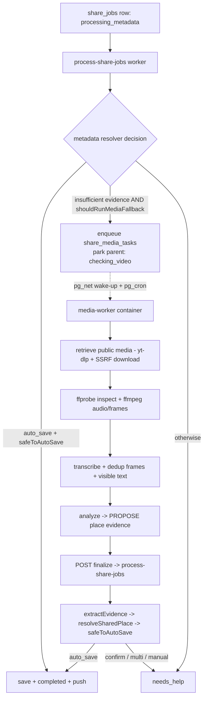
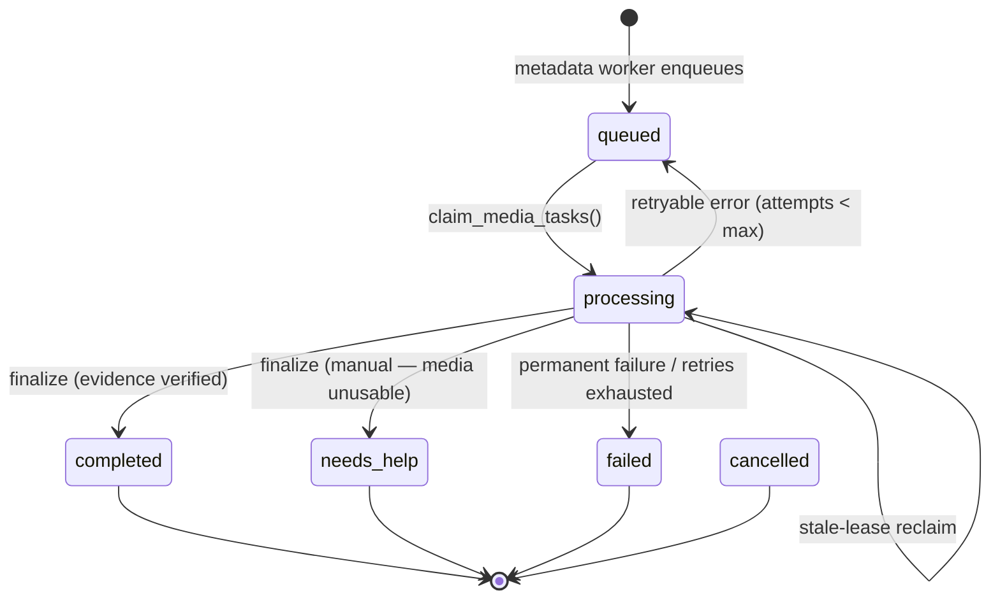

# Nearr — Media Fallback (Phase 2)

> Status: implemented behind **server-only** flags, all default **OFF**
> (`MEDIA_FALLBACK_ENABLED`, `INSTAGRAM_MEDIA_RESOLVER_ENABLED`,
> `NATIVE_VIDEO_ANALYSIS_ENABLED`). Instagram public posts only.
> Phase 1 (metadata-first async share jobs) is unchanged and remains the
> user-facing source of truth.

Phase 2 adds a **durable, private video-analysis fallback** for share jobs whose
metadata evidence was insufficient. When the Phase 1 resolver cannot verify a
place from caption/metadata, the worker enqueues one media task; a separate
containerized service retrieves the public video **temporarily**, extracts
spoken + visible place evidence, and hands that evidence back to Nearr's
**existing deterministic resolver + `safeToAutoSave` gate**.

## Core product rule

The model **proposes** evidence. Nearr's deterministic safety gate **decides**.
A video model can never directly create a saved place — evidence always flows
through the identical `extractEvidence → resolveSharedPlace → safeToAutoSave →
saveForUser` pipeline used by the metadata path. Wrong silent saves are worse
than asking the user.

## Architecture



- The media worker lives in [`services/media-worker`](../services/media-worker)
  — a standalone Node/TypeScript container with `ffmpeg`/`ffprobe`/`yt-dlp`.
  It is isolated from the Expo dependency graph (Metro block-list + app
  `tsconfig` exclude).
- The worker **proposes evidence only**. Verification, Google Places lookup,
  scoring, `safeToAutoSave`, and `saveForUser` all stay in the Deno
  `process-share-jobs` finalizer — there is **no parallel resolver**.

## Task state machine



The **parent `share_jobs` row is the user-facing source of truth**. While a
media task runs, the parent stays `processing_metadata` (shown as "Processing")
with a far-future lease (`MEDIA_PARENT_LEASE_SECONDS`, default 20 min). If the
media worker never finalizes, the **existing metadata claim reclaims the parent
after the lease expires** and (because a media task now exists) routes it to
`needs_help` — so a parent can never get stuck, even during a rollback that
stops the media worker.

## Fallback trigger (`shouldRunMediaFallback`)

Pure, unit-tested ([mediaFallback.ts](../supabase/functions/process-share-jobs/mediaFallback.ts),
[testMediaFallbackTrigger.ts](../scripts/testMediaFallbackTrigger.ts)).

**Never runs** when: any Phase 2 flag is off; platform is not Instagram (or the
IG resolver flag is off); the job is terminal/cancelled; a media task already
exists; metadata safely auto-saved; multi-place already resolved (or ≥2 explicit
addresses); or the failure is unrelated to missing media evidence
(`places_error`, `roundup_post`).

**Runs** when, on a supported platform with no existing task: `manual_fallback`;
generic caption blocked all queries; resolver `failed` (recoverable); a weak
single `candidate_confirmation`/`candidate_picker` that is **not**
address-verified; or an `auto_save` that failed the safety gate.

## Media resolver interface

Platform-neutral ([MediaResolver.ts](../services/media-worker/src/resolvers/MediaResolver.ts)):

```ts
interface MediaResolver {
  readonly name: string;
  supports(input: { platform: string; url: URL }): boolean;
  resolve(input: { jobId; sourceUrl; canonicalUrl?; workDir; signal }): Promise<ResolvedMedia>;
}
```

Structured error codes (never carry secrets/cookies/auth in detail):
`unsupported_platform`, `unsupported_url`, `private_or_unavailable`,
`authentication_required`, `provider_changed`, `redirect_limit`,
`download_timeout`, `download_failed`, `file_too_large`, `duration_too_long`,
`invalid_media`, `missing_video`, `ssrf_blocked`, `cancelled`.

### Instagram resolver + limitations

[InstagramMediaResolver.ts](../services/media-worker/src/resolvers/InstagramMediaResolver.ts)
— **public posts only**. No login, no user credentials, no copied cookies, no
private/challenge/CAPTCHA bypass, no proxy rotation, no anti-bot evasion, no
long-lived browser profile. Method: `yt-dlp -j` (metadata only) to obtain a
direct progressive CDN URL + duration, then our own SSRF-guarded, size-capped
download. If Instagram's markup changes and extraction fails → `provider_changed`
and a safe `needs_help(manual)` — never a fabricated result.

> The linked MIT project `riad-azz/instagram-video-downloader` was inspected but
> **not used**: it is a Next.js educational frontend that defers its downloader
> backend. `yt-dlp` is the proven retrieval method (also used by the repo's
> `evidence-server` prototype).

## Media security model

- HTTPS only; host allowlist (Meta CDNs by default, `MEDIA_ALLOWED_HOSTS`).
- SSRF checks before every fetch; DNS resolution rejected if it maps to
  loopback / private (v4+v6) / link-local / unique-local / CGNAT / cloud-metadata.
- Hard redirect limit; streaming response-size cap; MIME/`ffprobe` validation;
  max duration + max size + download timeout + whole-job timeout.
- Per-job isolated temp dir; guaranteed cleanup in `finally`; concurrency limit;
  cancellation via `AbortSignal`. No shell (argv-only `child_process`).

| Limit | Default | Why |
| --- | --- | --- |
| max duration | 180 s | short-form clips; longer rarely a place video |
| max download | 150 MB | generous for ≤180 s 1080p; bounds disk/egress |
| download timeout | 60 s | a stalled CDN fetch must not hold a slot |
| whole-job timeout | 8 min | ceiling incl. model calls |
| max frames | 24 | visual coverage without runaway model cost |
| redirect limit | 3 | public CDNs rarely need more |
| worker concurrency | 1 | conservative start |

## Evidence schema (generic, category-agnostic)

Zod ([evidence.ts](../services/media-worker/src/types/evidence.ts)); supports
restaurants, hotels, beaches, trails, parks, stores, landmarks, venues, museums,
and any Google-Places-compatible destination.

```jsonc
{
  "places": [{
    "name": "", "category": "", "address": "", "city": "", "region": "", "country": "",
    "coordinates": null, "role": "primary|secondary|passing_mention", "confidence": 0,
    "explicitEvidence": [{ "timestampSeconds": 0, "source": "caption|speech|visible_text|frame", "value": "" }],
    "inferredEvidence": []
  }],
  "multipleIntentionalPlaces": false,
  "insufficientEvidence": false,
  "warnings": []
}
```

**Fabrication guard** ([mediaEvidence.ts](../supabase/functions/process-share-jobs/mediaEvidence.ts)):
only places with ≥1 **explicit** evidence item are rendered into the synthetic
caption fed to `extractEvidence`; passing mentions are dropped; secondary places
appear only when `multipleIntentionalPlaces`; model **coordinates are never
forwarded**. So even a hallucinated address must still be verified by Google
Places against a real business before anything can auto-save.

## Deterministic verification path

`media evidence → renderMediaEvidenceCaption → extractEvidence →
resolveSharedPlace → planFromResolverDecision → (saveForUser | needs_help)` —
byte-identical to the metadata path. `safeToAutoSave` is never loosened.

| finalize outcome | parent result |
| --- | --- |
| verified auto-save (safe) | `completed` + saved + push |
| candidate confirmation / multi / manual | `needs_help` |
| media unavailable / permanent failure | `needs_help(manual)` |
| retryable failure | media task requeued (parent stays processing) |

## Model prompt versioning

Versioned system prompt ([placeEvidencePrompt.ts](../services/media-worker/src/prompts/placeEvidencePrompt.ts));
`PROMPT_VERSION` is persisted into `share_media_runs` diagnostics. The model must
not pick a Place ID, decide `safeToAutoSave`, save, invent an address/coords, or
turn a cuisine/dish/event/neighborhood/creator into a business without evidence.

## Privacy & retention

- Download to ephemeral worker storage; analyze in the same task; **delete
  video, audio, frames, and temp files in `finally`** (success/failure/cancel/
  timeout). Retry re-downloads.
- The downloaded MP4 is **never** returned to the mobile client and **never**
  archived. No Supabase Storage upload.
- Logged: task id, share job id, platform, progress stage, resolver name,
  duration, frame count, evidence count, sanitized failure code, latency.
- Never logged: access tokens, cookies, service-role key, worker secret, full
  media URLs with query tokens, raw video/audio, or entire model responses.

## Local development

```bash
cd services/media-worker
cp .env.example .env         # set SHARE_MEDIA_WORKER_SECRET + Supabase
npm install
npm run typecheck
npm test                     # unit + ffmpeg integration (auto-skips w/o ffmpeg)
npm run dev
```

Database (from repo root, local Supabase running):

```bash
supabase db reset            # applies the two Phase 2 migrations
supabase db lint
# RLS + durability suites (auth.users seeded by scripts/seedTestUsers.sql):
docker cp scripts/seedTestUsers.sql supabase_db_Nearr:/tmp/seed.sql
docker exec supabase_db_Nearr psql -U postgres -d postgres -f /tmp/seed.sql
docker cp scripts/testShareMediaRls.sql supabase_db_Nearr:/tmp/rls.sql
docker exec supabase_db_Nearr sh -c "psql -U postgres -d postgres -q \
  -v user_a=11111111-1111-4111-8111-111111111111 \
  -v user_b=22222222-2222-4222-8222-222222222222 -f /tmp/rls.sql 2>&1"
docker cp scripts/testShareMediaDurability.sql supabase_db_Nearr:/tmp/dur.sql
docker exec supabase_db_Nearr sh -c "psql -U postgres -d postgres -q \
  -v user_id=11111111-1111-4111-8111-111111111111 -f /tmp/dur.sql 2>&1"
```

## Deployment runbook (provider-neutral)

1. Commit + review Phase 2.
2. Apply the migration to development (`supabase db push`).
3. Configure media-worker secrets (`SHARE_MEDIA_WORKER_SECRET`, Supabase URL +
   service-role key) via your secret store.
4. Deploy the media-worker container; confirm `GET /ready` is healthy.
5. Store the worker URL + invocation secret in Vault:
   `select vault.create_secret('https://<worker-host>', 'share_media_worker_url');`
   `select vault.create_secret('<SHARE_MEDIA_WORKER_SECRET>', 'share_media_worker_secret');`
6. Deploy the updated `process-share-jobs`.
7. Verify the `process-media-tasks-sweep` cron job exists and the AFTER-INSERT
   pg_net wake-up fires.
8. Keep **all** media flags OFF. Confirm metadata-only behavior is unchanged.
9. Run a synthetic media job in development.
10. Enable only `MEDIA_FALLBACK_ENABLED`.
11. Enable `INSTAGRAM_MEDIA_RESOLVER_ENABLED` for one internal/controlled test.
12. Verify metadata-only successes still avoid video processing.
13. Verify media failures become safe `needs_help` outcomes.
14. Test push + queue behavior.
15. Roll back by disabling media flags + unscheduling the media cron.

## Rollback

Fastest (server-only, no client build):

1. Set `MEDIA_FALLBACK_ENABLED=false` (no new media tasks; `shouldRunMediaFallback`
   returns false → zero new DB calls).
2. `select cron.unschedule('process-media-tasks-sweep');` and/or stop the worker.
3. Leave durable media-task rows intact. Parked parents are rescued to
   `needs_help` by the existing metadata claim once their lease expires.

Phase 1 never depends on media-worker availability. Full teardown = the DOWN
sections in the two Phase 2 migrations.

## Test matrix

| Layer | Suite | Coverage |
| --- | --- | --- |
| Trigger | `scripts/testMediaFallbackTrigger.ts` | flags off, every trigger/non-trigger |
| Adapter | `scripts/testMediaEvidenceAdapter.ts` | schema, fabrication guard, roles |
| DB RLS | `scripts/testShareMediaRls.sql` | client no access, worker RPC locked, invariants |
| DB durability | `scripts/testShareMediaDurability.sql` | claim, stale reclaim, attempts, terminal, expire |
| Worker unit | `services/media-worker/tests/*.test.ts` | SSRF, schema, frame select/dedup, errors, auth |
| Worker integration | `tests/integration/pipeline.test.ts` | ffprobe/frames/dedup/limits/cleanup on synthetic media |
| Live (opt-in) | `test:*-live` | real IG retrieval, worker endpoints, native model |

## Known platform fragility

- Instagram markup / CDN behavior can change → `provider_changed` → safe manual
  fallback (never a wrong save).
- Public retrieval can be rate-limited (retryable; parent never wrongly failed).
- DNS rebinding is only partially mitigated (host allowlist; no socket pinning)
  — same accepted limitation as Phase 1.
- TikTok / Facebook retrieval is intentionally **not** implemented in Phase 2.
